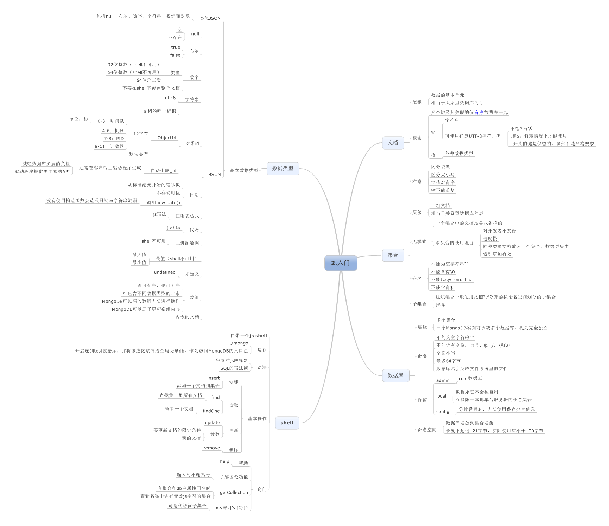
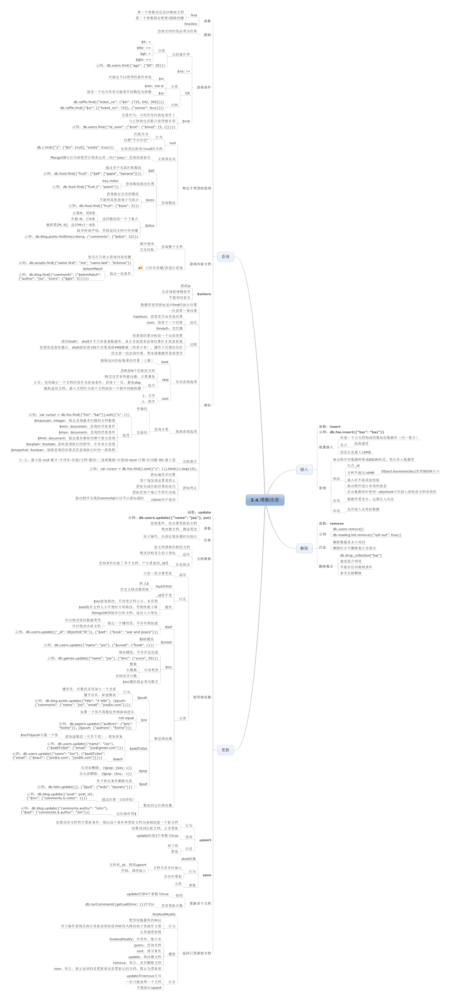
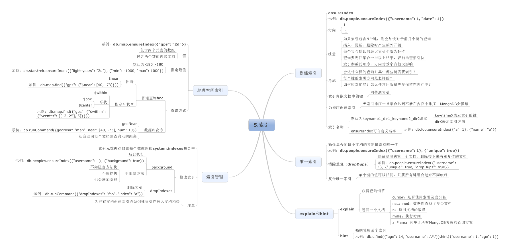
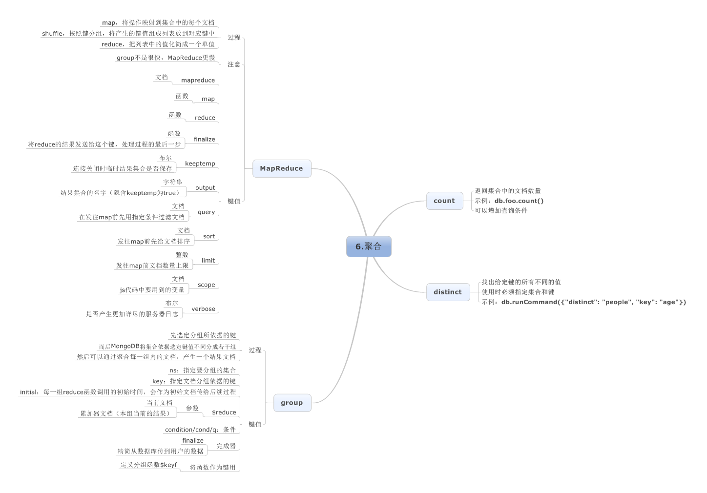
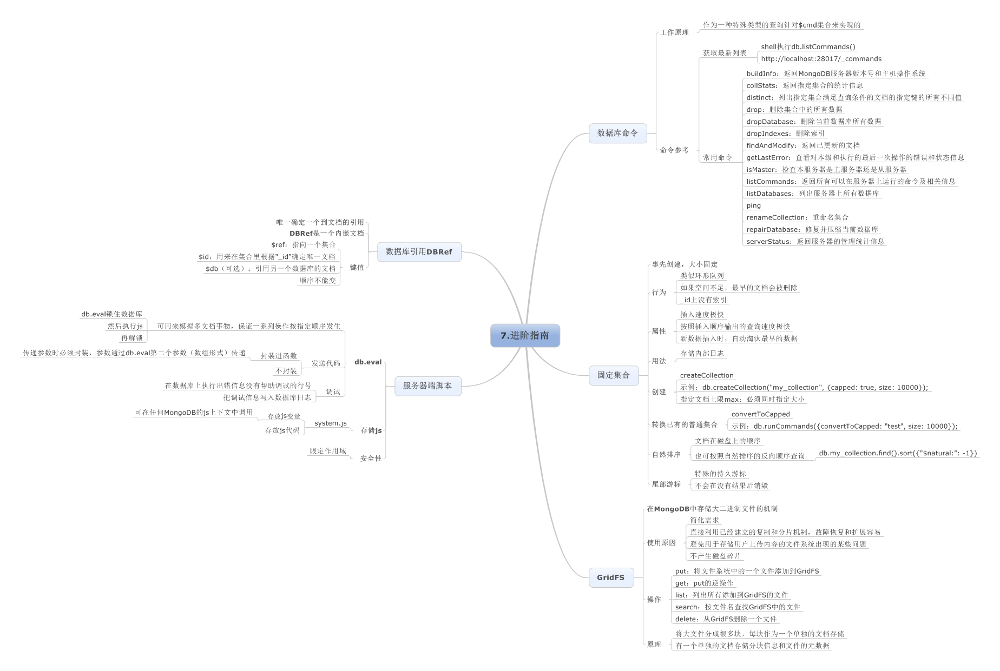
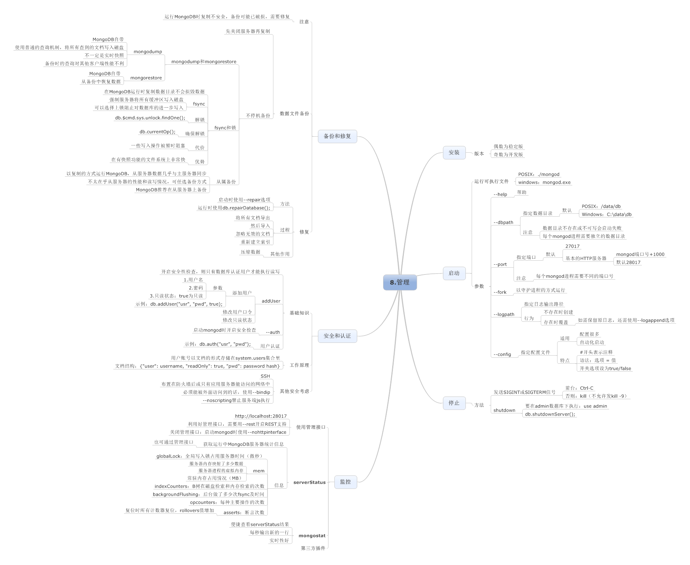
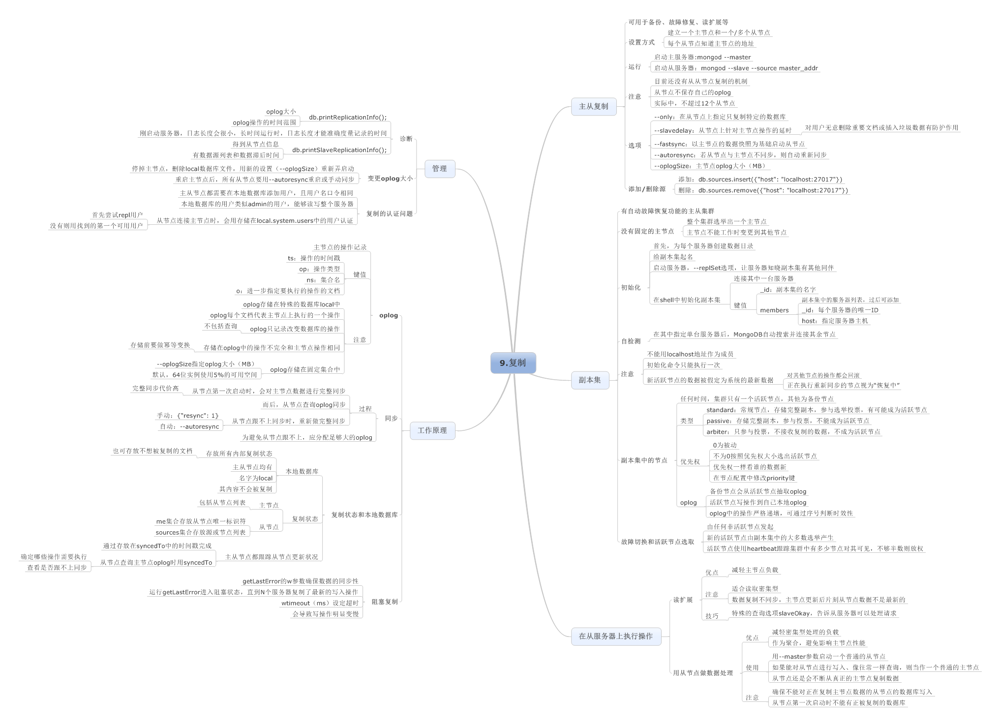
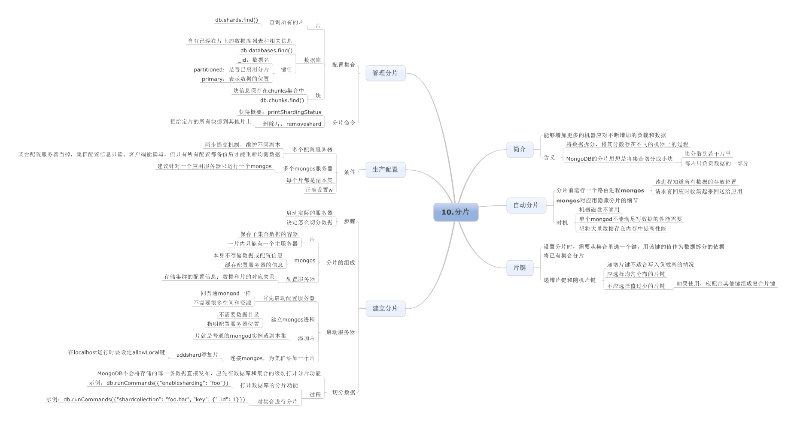

### 学习资料

[MongoDB中文手册|官方文档中文版](https://docs.mongoing.com/)

[MongoDB 教程 菜鸟教程](https://www.runoob.com/mongodb/mongodb-tutorial.html)

[Spring Data MongoDb官方文档](https://docs.spring.io/spring-data/mongodb/docs/3.0.4.RELEASE/reference/html/#introduction)

[MongoDB快速入门，掌握这些刚刚好！](http://www.macrozheng.com/#/reference/mongodb_start)

[mall整合Mongodb实现文档操作](https://mp.weixin.qq.com/s?__biz=MzU1Nzg4NjgyMw==&mid=2247483728&idx=1&sn=5fb894f603df69ba96b225899d3faf71&chksm=fc2fbd58cb58344ec4417eb3a0891054fee4599109618a240a9a85eac2a27ccf622c4ad94eab&scene=178#rd)

### mongodb权威指南思维导图

### 面试题

[MongoDB面试题](https://www.cnblogs.com/angle6-liu/p/10791875.html)